# Note App

## Table of Contents

- [About](#about)
- [Screenshots](#screenshots)
- [Prerequisites](#prerequisites)
- [Getting Started](#getting-started)
  - [Clone the Repository](#clone-the-repository)
  - [Flutter Package Dependencies](#flutter-package-dependencies)
- [Firebase Setup](#firebase-setup)
- [Payment Setup](#payment-setup)

## About

<div align="center">
  
  
</div>
  Job Portal App: Discover job opportunities, apply seamlessly using our Flutter and Firebase-powered platform for efficient job hunting and recruitment.

## Screenshots

<div style="display: flex; justify-content: space-between;">
 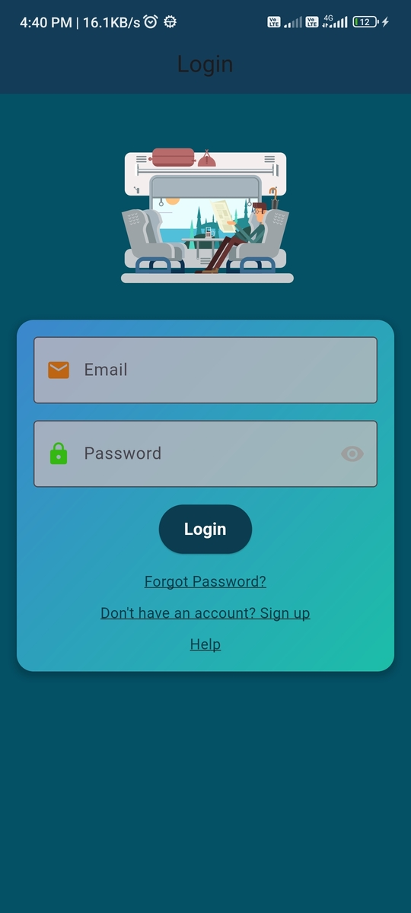
    
    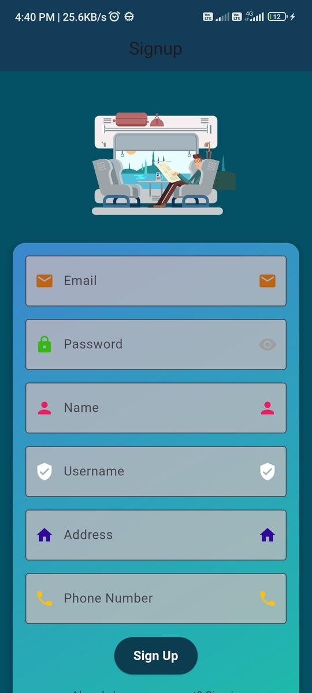
    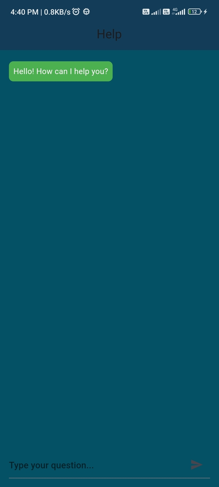
    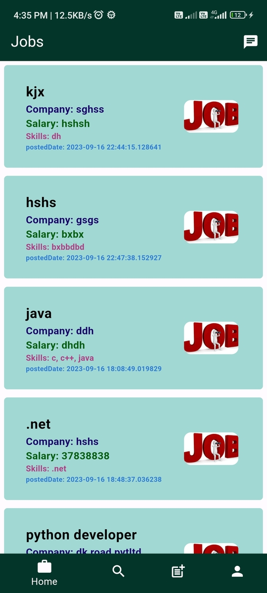
    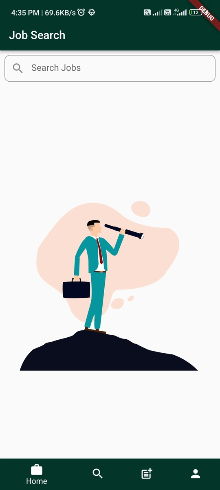
    
    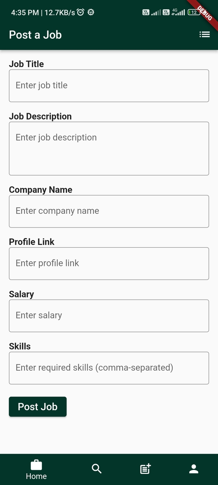
    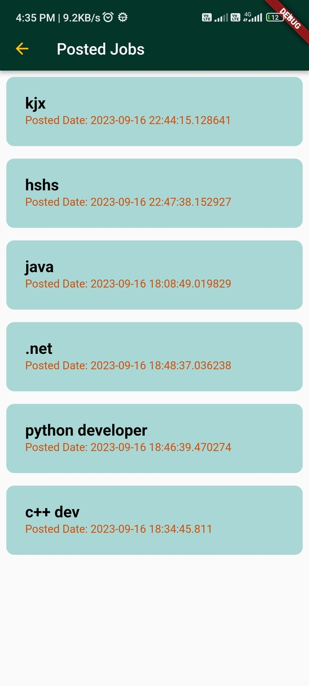
    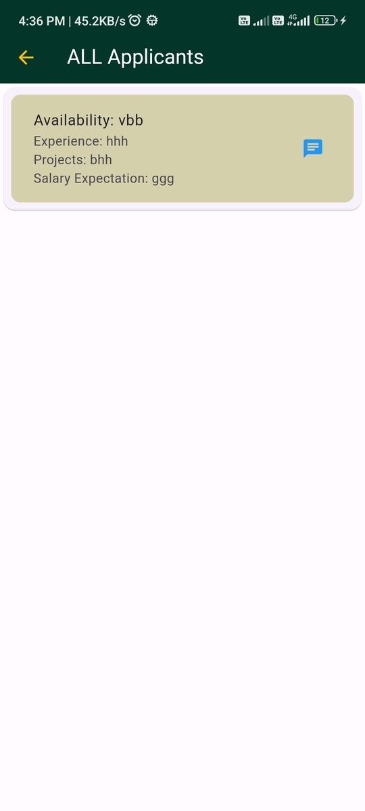
    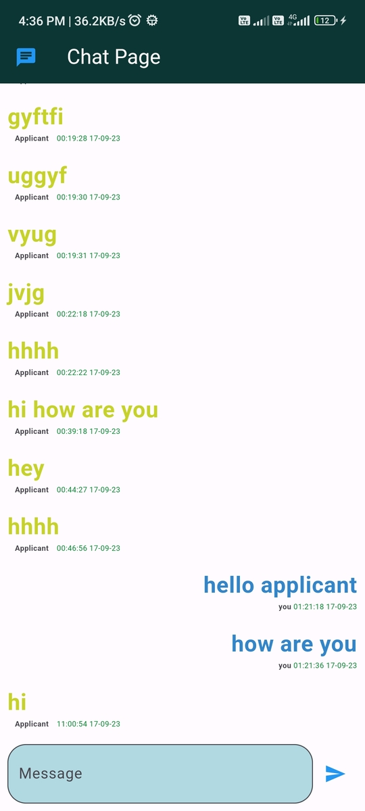
    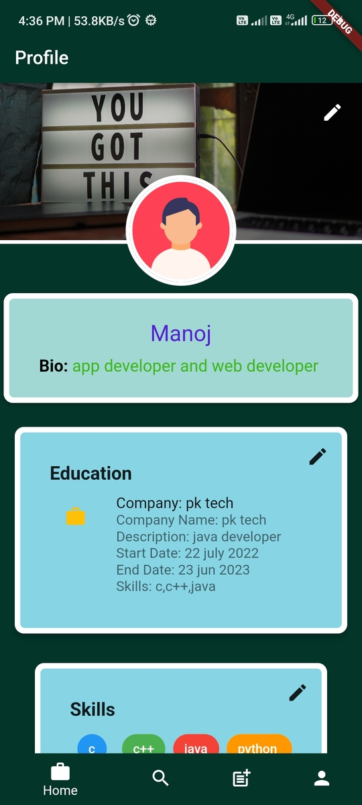
    
    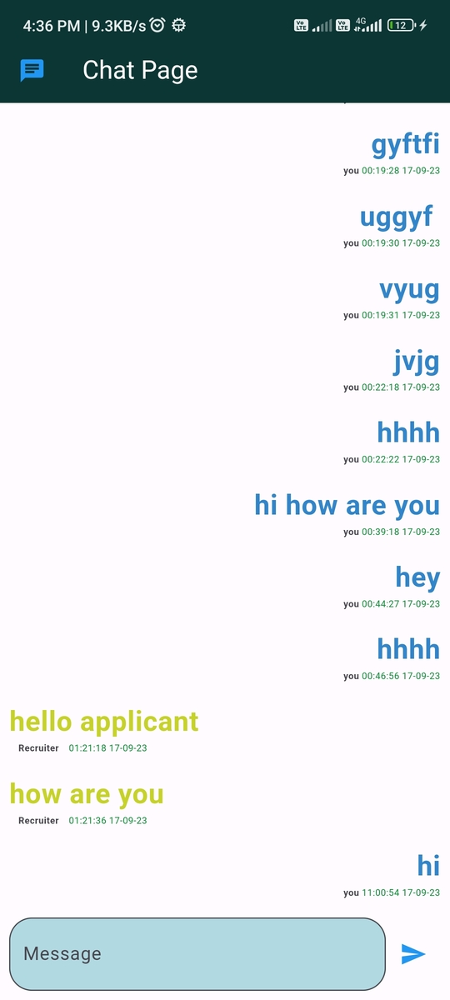
    
    
    
    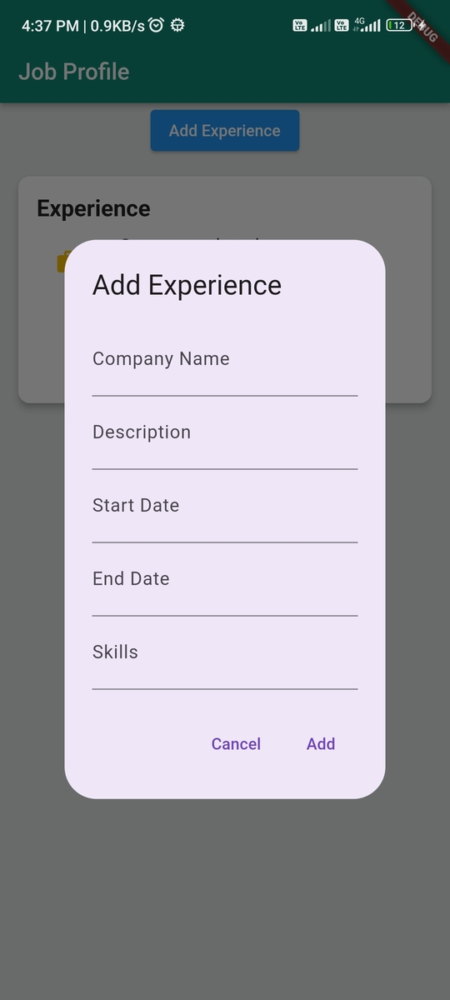
    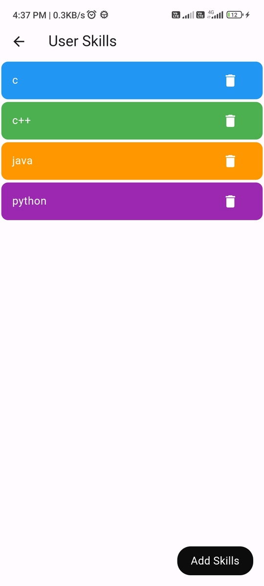
    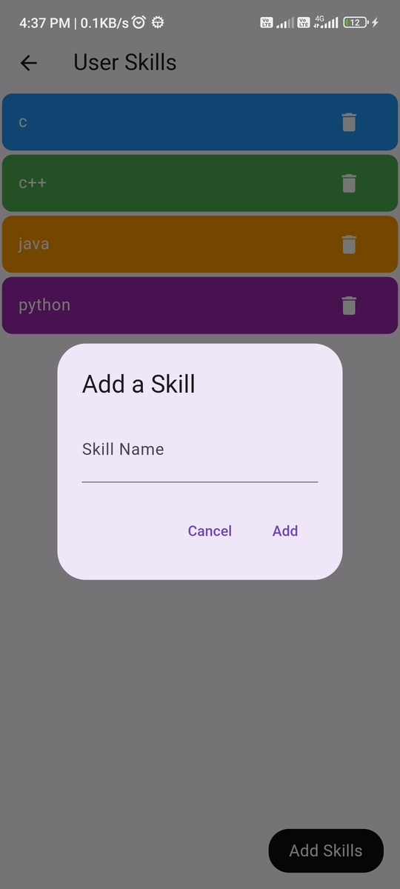
</div>

## Prerequisites

Before you begin, make sure you have the following prerequisites:

- [Flutter](https://flutter.dev/) installed on your development environment.

## Getting Started

Follow these steps to create a Flutter Firebase page with Firestore and Email/Password Authentication:

#### Clone the Repository:

1. Clone this repository:

   ```bash
   git clone https://github.com/ABHISHEKKUMAR89207/Job-Search-App.git
   ```

#### Flutter Package Dependencies

2. flutter Package Dependencies
   Open project on Vs code / Android Studio and Run this command on terminal
   ```bash
   flutter pub get
   ```

## Firebase Setup

### Flutter Firebase Authentication and Database Setup

This guide will help you set up Firebase Authentication and Firebase Database for your Flutter project. Firebase is a platform that provides backend services such as authentication, real-time databases, and cloud functions.

### Step 1: Set Up Firebase Project

1. Go to the Firebase Console [here](https://console.firebase.google.com/).
2. Click on "Add Project" and follow the setup wizard to create a new Firebase project.
3. Configure the project settings, including the project name and region.
4. Once the project is created, click "Continue."

### Step 2: Add Your App to Firebase

1. In the Firebase Console, select your project.
2. Click on "Add app" and choose the appropriate platform (iOS/Android).
3. Follow the setup instructions for your chosen platform. This includes downloading configuration files (e.g., `google-services.json` for Android or `GoogleService-Info.plist` for iOS) and adding them to your Flutter project later.
4. Complete the setup for both Android and iOS if you plan to support both platforms.

### Step 3: Set Up Firebase Authentication

1. In the Firebase Console, go to the "Authentication" section.
2. Enable the "Email/Password" sign-in method.
3. Configure other authentication settings as needed, such as password reset and email verification.
4. Firebase Authentication is now ready to use in your Flutter app.

### Step 4: Set Up Firebase Realtime Database or Firestore

1. In the Firebase Console, choose the "Database" section.
2. Create a new Firestore database or Realtime Database, depending on your needs.
3. Set up security rules to control access to your database.
4. Firebase Database is now ready to use in your Flutter app.

## Payment Setup

### Add your RozarPay Api key on :

Online_Shopping_App-flutter.firebase.rozarpay\lib\profile\cart_page.dart

Happy coding!
